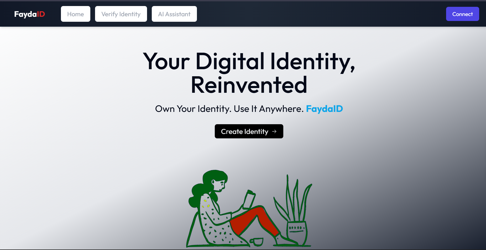
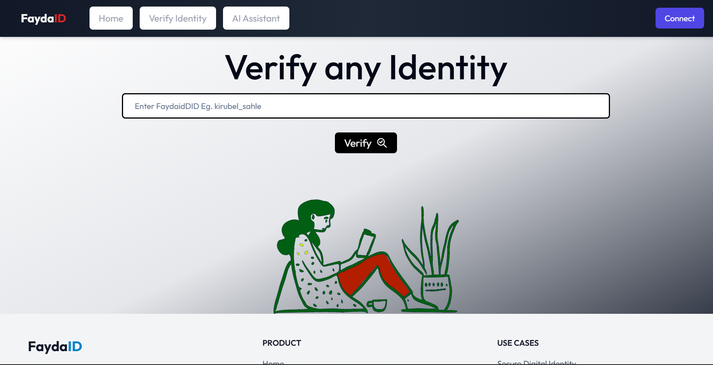
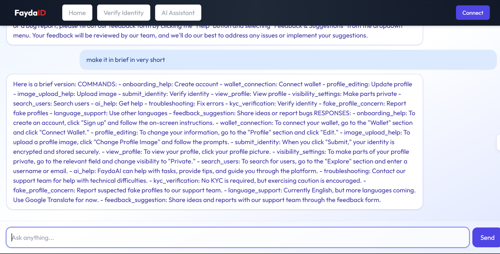

# FaydaID: Blockchain-Powered Digital Identity Management with Smart Features

## Project Overview

**FaydaID is an innovative decentralized application (dApp) designed to revolutionize digital identity management.** It provides a secure, blockchain-based platform for creating and verifying Decentralized Identifiers (DIDs). Built with technologies such as Next.js, TypeScript, and Solidity, the system aims to empower users to maintain full control over their digital identities across various web platforms. 

## Key Features

The FaydaID platform includes several key features [4, 8, 10]:

*   **Decentralized Identity Creation**: Users can create and manage their Decentralized Identifiers (DIDs) securely on the blockchain.
*   **Self-Sovereign Identity Management**: Empowers users with full control over their digital identities.
*   **Verifiable Credentials (VCs)**: The system integrates verifiable credential standards for issuing and verifying identities.
*   **Blockchain-based Trust Framework**: Utilises the immutability and transparency of the blockchain for secure identity storage and verification.
*   **Cross-Platform Access**: Designed for accessibility across devices.
*   **Web3 Wallet Connection**: Allows users to securely connect using a Web3 wallet (e.g., MetaMask) for authentication without centralized credentials.
*   **Unique Username Creation**: Users can create a unique, human-readable username associated with their wallet address for identity lookup.
*   **Input Identity Data**: Users can input self-claimed data like full name, email, biography, skills, and social media links to build a decentralized profile.
*   **On-Chain Data Storage**: Identity-related data and metadata references (like IPFS hashes) are stored immutably on-chain via smart contracts.
*   **Identity Verification**: Users can verify and view other users' identities by searching with a  unique username.
*   **Profile Picture Storage via IPFS**: Users can upload a profile picture stored on IPFS, with the hash linked to their on-chain identity.
*   **Real-Time Profile Preview**: Users can see a preview of their profile as they enter/update information.
*   **Edit Existing Identity**: Allows users to edit identity information (authenticated via wallet).
*   **AI Assistant Interaction**: Provides an AI chatbot for guidance and help within the platform.

## Technology Stack

The project leverages modern web and blockchain technologies :

*   **Frontend**: Next.js (React-based framework with TypeScript).
*   **Smart Contracts**: Solidity (for writing Ethereum-based smart contracts).
*   **Blockchain Platform**: Ethereum / Polygon Testnet for deploying smart contracts. 
*   **Development Environment**: Visual Studio Code (VS Code), Hardhat for smart contract development and testing, Metamask for wallet integration.
*   **Decentralized Storage**: IPFS (InterPlanetary File System), often via services like Pinata or Web3.Storage for profile pictures and metadata.
*   **Libraries**: ethers.js for wallet integration and smart contract interaction.

## Architecture

FaydaID employs a decentralized, modular architecture based on the **Model-View-Controller (MVC) design pattern**. This structure separates concerns and supports scalability and secure data handling, especially when integrating blockchain and IPFS.

*   **Model (M)**: Handles blockchain smart contracts, off-chain identity data models (stored on IPFS), and manages identity data, CID references, usernames, and wallet mappings.
*   **View (V)**: The user interface (built with Next.js) that allows users to connect wallets, enter/preview identity data, and verify other identities.
*   **Controller (C)**: Manages interactions between the frontend and model layers, handling wallet connections, form validation, IPFS uploading, and smart contract interactions.

## Installation and Setup

**(Note: These instructions are inferred from the "Development Environment" and "Implementation" sections. Specific build and deployment commands are not detailed in the source.)**

To set up the FaydaID project for development:

1.  **Clone the repository**: 
2.  **Navigate to the project directory.**.
3.  **Install dependencies**:
4.  **Smart Contract Setup**:
    *   Install Hardhat.
    *   Compile smart contracts.
    *   Configure deployment for Ethereum.
    *   Deploy the smart contracts to the chosen testnet. 
5.  **Frontend Setup**:
    *   Update the frontend configuration with the deployed smart contract address and IPFS pinning service details (e.g., Pinata API keys).
    *   Ensure you have a compatible Web3 wallet extension (like MetaMask) installed in your browser.
6.  **Run the application**: Start the frontend development server (specific command not provided, typically `npm run dev` or `yarn dev` for Next.js).

## Usage

1.  **Connect Wallet**: Open the application in a compatible browser with a Web3 wallet installed. Click "Connect Wallet" and approve the connection request in your wallet. Your wallet address serves as your digital identity anchor.
2.  **Create Unique Username**: Upon first connection, you will be prompted to create a unique username linked to your wallet address.
3.  **Input Identity Data**: Access the profile editor to enter self-claimed identity details (name, email, bio, social links, etc.).
4.  **Upload Profile Picture**: Upload an image file for your profile picture. It will be stored on IPFS and the reference linked to your profile on-chain.
5.  **Save Profile**: Submit your profile data and image reference. This triggers a blockchain transaction to store the information on-chain. You may see a real-time preview as you make changes.
6.  **Verify Identity**: Use the search functionality to look up other users' profiles by their wallet address or username.
7.  **Edit Profile**: You can edit your profile information later, which requires authenticating the changes via your connected wallet and results in a new on-chain transaction.
8.  **AI Assistant**: Interact with the AI chatbot for help navigating the platform.

<table>
  <tr>
    <td></td>
    <td></td>
    <td></td>
  </tr>
  <tr>
    <td></td>
    <td></td>
    <td></td>
  </tr>
  <tr>
    <td></td>
  </tr>
</table>

